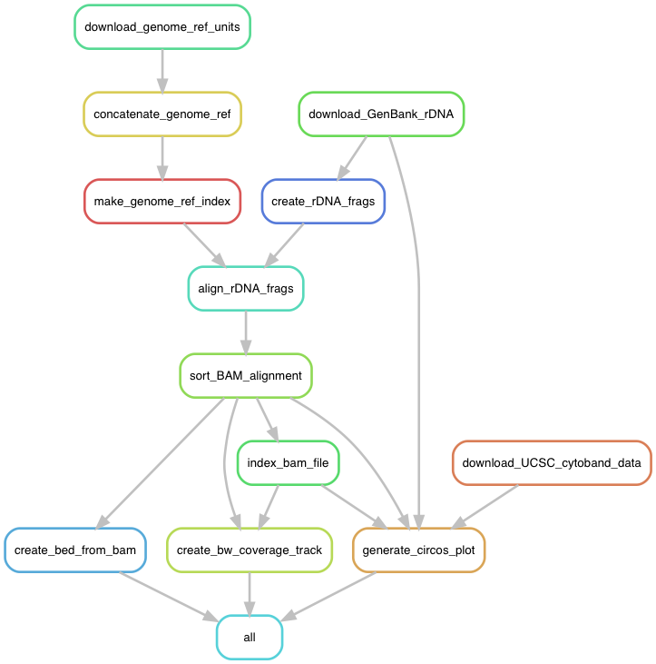
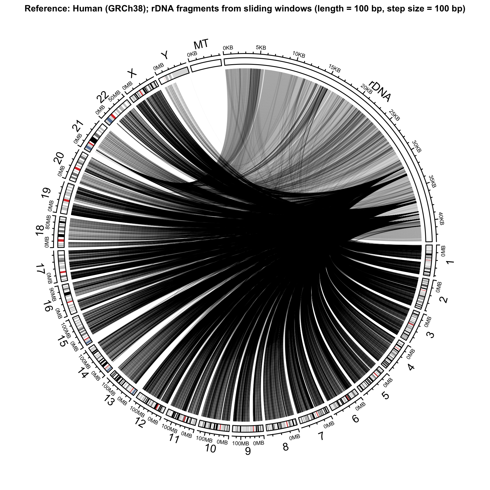
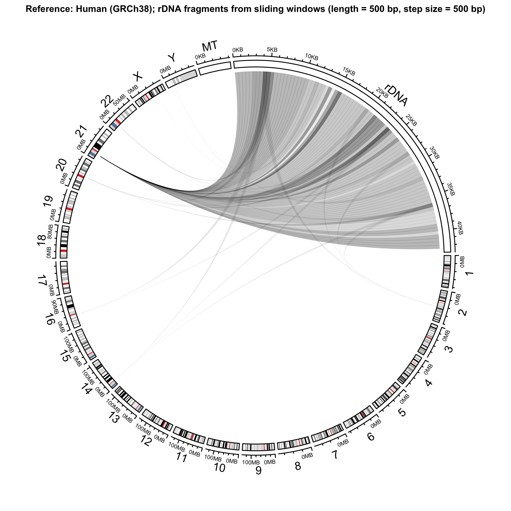
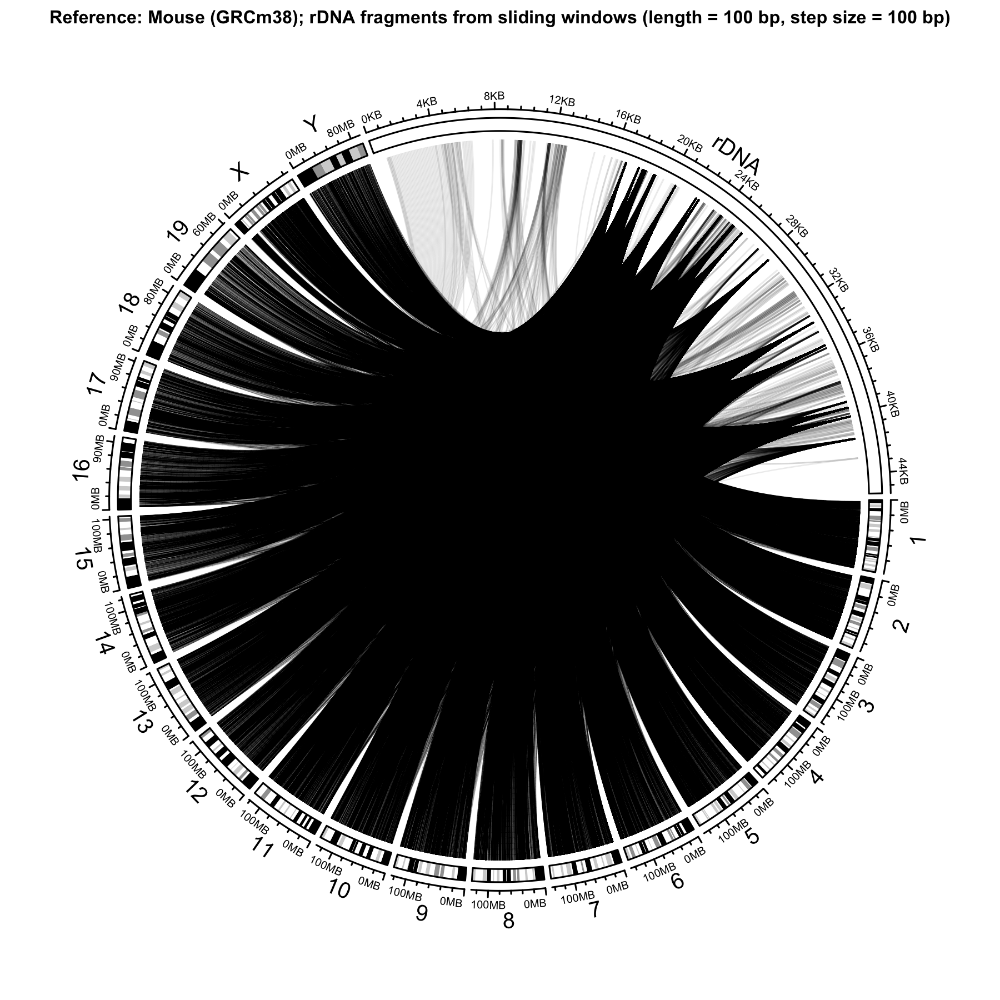
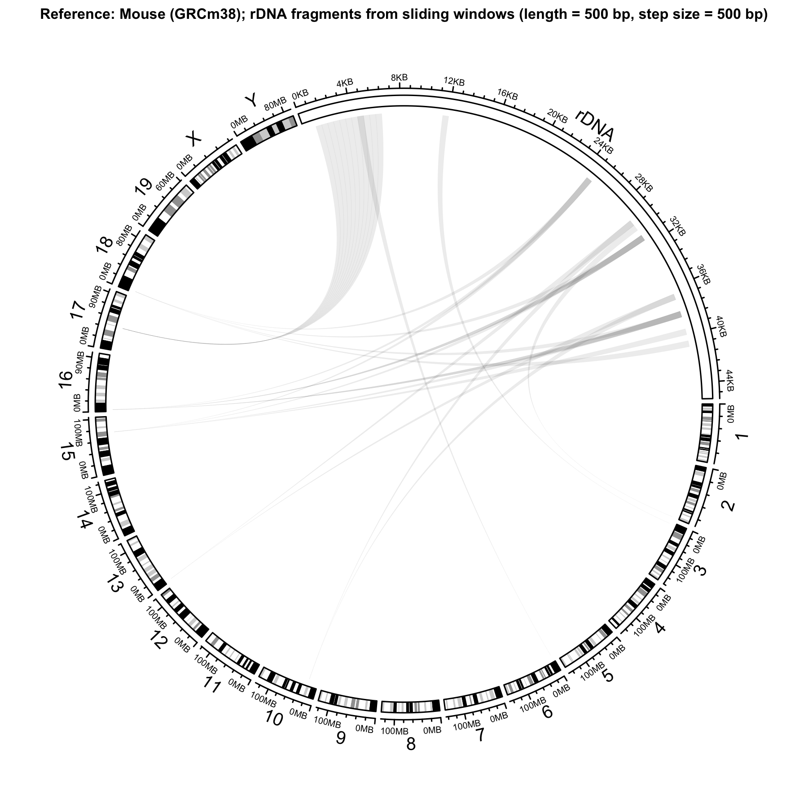
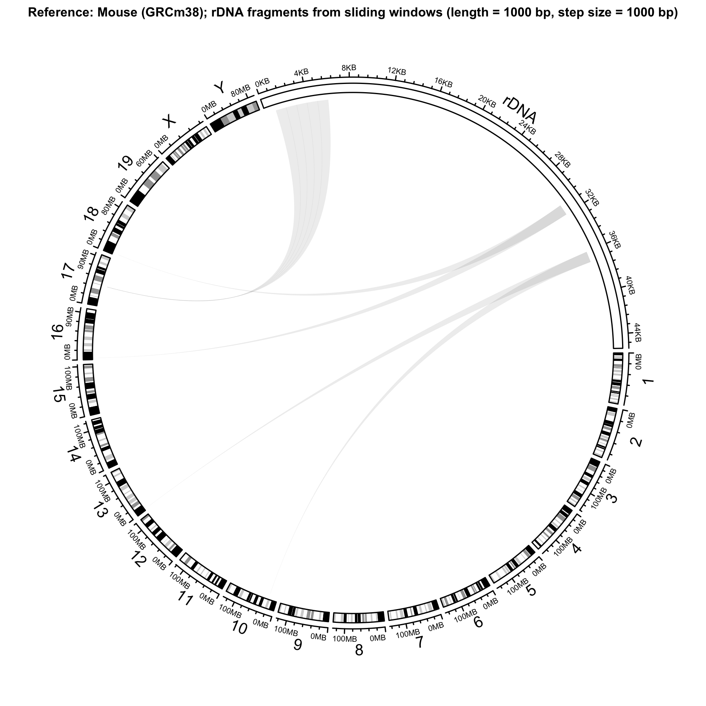

# frag_align_rDNA workflow

This is the repository for the `snakemake` workflow `frag_align_rDNA`. In a
nutshell, the workflow creates artificial reads from the canonical human and
mouse rDNA sequences [U13369](https://www.ncbi.nlm.nih.gov/nuccore/555853)
and [BK000964](https://www.ncbi.nlm.nih.gov/nuccore/BK000964),respectively, and
aligns reads to the corresponding reference genome to help identify rDNA-like
regions across the genome.


## Summary

`snakemake` rule DAG



The workflow consists of the following steps:

- Download human and mouse reference genome files from Ensembl
- Concatenate individual genome reference files and create a single reference
file for `bowtie2`
- Index the single reference files with `bowtie2-build`
- Download the rDNA reference sequences from GenBank:
[U13369](https://www.ncbi.nlm.nih.gov/nuccore/555853) for human,
[BK000964](https://www.ncbi.nlm.nih.gov/nuccore/BK000964) for mouse.
- Fragment rDNA sequence using a non-overlapping sliding-window approach using
a read length of L = 100, 500 and 1000 bp. This is done using a custom Python
script [`workflow/scripts/fragment_seq.py`](workflow/scripts/fragment_seq.py).
The script also allows for overlapping sliding-windows as well as sampling
uniformly from the reference sequence. Details on how to call `fragment_seq.py`
can be found in the [`snakemake` rule](workflow/rules/create_align_rDNA_frags.smk).
- Align all rDNA subsequences to the corresponding reference genome with
`bowtie2`, using default parameters except for switch `--all` to report *all*
alignments.
- Index resulting BAM file with `samtools index`
- Create BigWig coverage track from BAM file using `deeptools` `bamCoverage`
- Create Circos plots to visualise the mapping of rDNA fragments to the
corresponding reference genome.


## Workflow deployment and requirements

The `snakemake` workflow should be entirely self-contained and reproducible.

Provided `snakemake` is installed, the workflow can be deployed to a new system
by following these steps

```
# Clone repository
git clone https://github.com/mevers/frag_align_rDNA
cd frag_align_rDNA

# Execute workflow
./run_workflow.sh
# Or explicitly:
# snakemake --use-conda
```

External dependencies include `bowtie2`, `samtools`, `deeptools` and `R` (along
with the additional R/Bioconductor libraries `tidyverse`, `Biostrings`,
`Rsamtools`, `circlize`), and will be met automatically through rule-specific
`conda` environments. There is no need to manually install `bowtie2` etc.,
although it doesn't affect the workflow if these tools are already installed.


## Details & comments

### Performance

Running `bowtie2` with `-all` to report *all* alignments leads to the alignment
taking a *very* long time. Be aware, when changing parameters of the rDNA
fragment process and increasing the number of rDNA fragments.

### Location of rDNA repeats across the genome

Human rDNA tandem repeats are located on the acrocentric chromosomes 13, 14,
15, 21, 22 (, Y).

References (by no means complete):

- [Agrawal and Ganley, The conservation landscape of the human ribosomal RNA gene repeats, PLOS ONE 0207531 (2018)](https://journals.plos.org/plosone/article?id=10.1371/journal.pone.0207531)
- [Kobayashi, Ribosomal RNA gene repeats, their stability and cellular senescence, Proc. Jpn. Acad. Ser. B Phys. Biol. Sci. 90, 119 (2014)](https://www.ncbi.nlm.nih.gov/pmc/articles/PMC4055705/)
- [Worton et al., Human ribosomal RNA genes: orientation of the tandem array and conservation of the 5' end, Science 239, 64 (1988)](https://www.ncbi.nlm.nih.gov/pubmed/3336775)


Mouse rDNA tandem repeats are located on chromosomes (11,) 12, 15, 16, 18 and 19.

References (by no means complete):

- [Gibbons et al., *Concerted copy number variation balances ribosomal DNA dosage in human and mouse genomes*, PNAS 112, 2485 (2015)](https://www.pnas.org/content/112/8/2485)
- [Henderson et al., *The chromosomal location of ribosomal DNA in the mouse*, Chromosoma 49, 155 (1974)](https://link-springer-com.virtual.anu.edu.au/article/10.1007/BF00348887)
- [Xu et al., *Ribosomal DNA copy number loss and sequence variation in cancer*, PLOS Genetics 1006771 (2017)](https://journals.plos.org/plosgenetics/article?id=10.1371/journal.pgen.1006771)


### Results

The Circos plots visualise where in the genome specific (non-overlapping)
fragments of the rDNA map to. The width of every arc corresponds to the length
of the fragment. The darker the shading the more regions a specific rDNA
fragment maps to.

#### Human

Fragment length = 100 bp, non-overlapping | Fragment length = 500 bp, non-overlapping | Fragment length = 1000 bp, non-overlapping
:---------:|:----------:|:-----------:
 |  | 

#### Mouse

Fragment length = 100 bp, non-overlapping | Fragment length = 500 bp, non-overlapping | Fragment length = 1000 bp, non-overlapping
:---------:|:----------:|:-----------:
 |  | 


### Bugs

None. Yet.


## Contact

Maurits Evers (maurits.evers@gmail.com)

Please raise any questions, concerns, bugs as an [Issue](https://github.com/mevers/frag_align_rDNA/issues) on the GitHub project
site.
